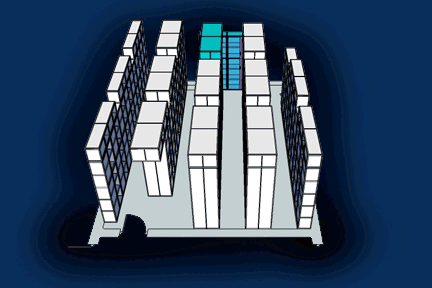

# Animations by Janitha Wijayawardana
> Stop motion animations created in GIF format.

The repo contains animations made by Janitha Wijayawardana. Feel free to download them or make more contributions.

## Preview

## Meta

Janitha Wijayawardana – [LinkedIn](https://www.linkedin.com/in/janitha-wijayawardana-4b57471ab/)

Distributed under the MIT license.

## Contributing

1. Fork it (<https://github.com/JanithaWijayawardana/animations>)
2. Create your feature branch (`git checkout -b feature/fooBar`)
3. Commit your changes (`git commit -am 'Add some fooBar'`)
4. Push to the branch (`git push origin feature/fooBar`)
5. Create a new Pull Request
